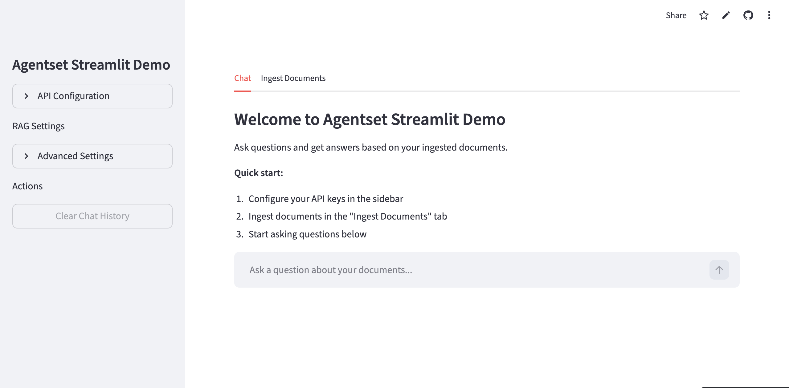
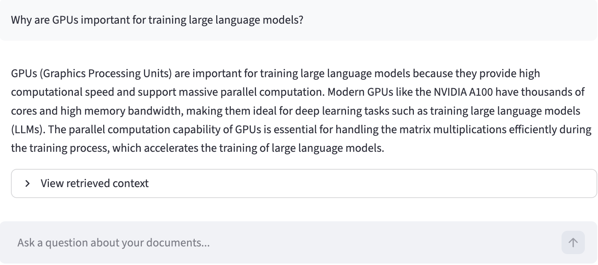
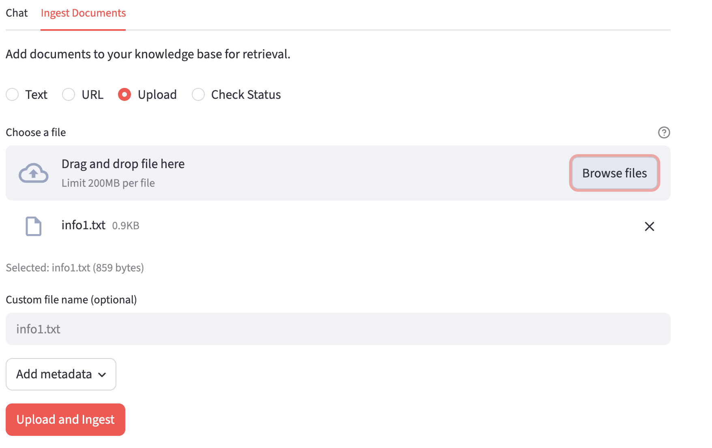
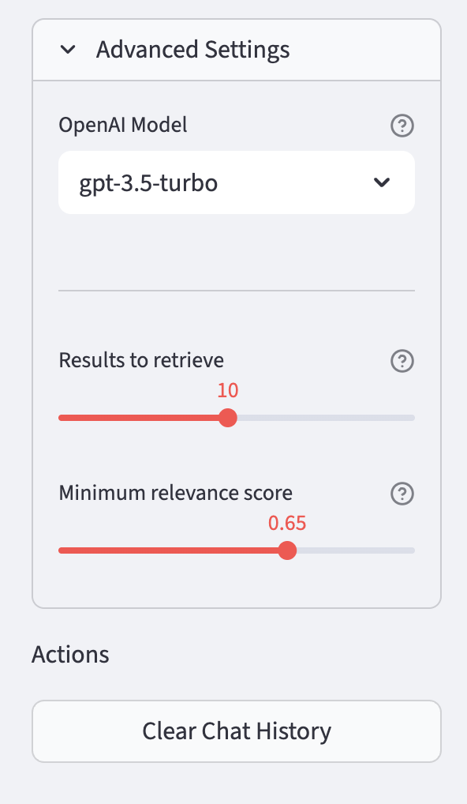

# 🔍 Agentset Streamlit Demo

A beautiful Streamlit application for document ingestion and intelligent Q&A powered by [Agentset](https://agentset.ai) and OpenAI.



## Features

- **Intelligent Chat** - Ask questions and get AI-generated answers based on your ingested documents
- **Multiple Ingestion Methods** - Ingest documents via text, URL, or file upload
- **Transparent Retrieval** - View the retrieved context used to generate responses
- **Configurable** - Adjust retrieval parameters like top-k results and minimum relevance score
- **Model Selection** - Choose from multiple OpenAI models

## 📸 Screenshots

<details>
<summary><strong>Chat Interface</strong></summary>

Ask questions and get AI-powered answers with source context visibility.



</details>

<details>
<summary><strong>Document Ingestion</strong></summary>

Easily add documents to your knowledge base via text, URL, or file upload.



</details>

<details>
<summary><strong>Configuration</strong></summary>

Configure API keys and fine-tune retrieval settings.



</details>

## 🚀 Quick Start

```bash
pip install agentset-streamlit-demo
agentset-streamlit-demo
```

Or run from source:

```bash
git clone https://github.com/agentset-ai/agentset-streamlit-demo.git
cd agentset-streamlit-demo
pip install -e .
agentset-streamlit-demo
```

## 📋 Requirements

- Python 3.8+
- [Agentset](https://agentset.ai) API key and namespace ID
- OpenAI API key

## 🔧 Configuration

1. **Get your Agentset credentials** at [agentset.ai](https://agentset.ai)
2. **Get your OpenAI API key** at [platform.openai.com](https://platform.openai.com)
3. **Launch the app** and enter your credentials in the sidebar


## 🔗 Links

- [Agentset Documentation](https://docs.agentset.ai)
- [OpenAI API](https://platform.openai.com/docs)
